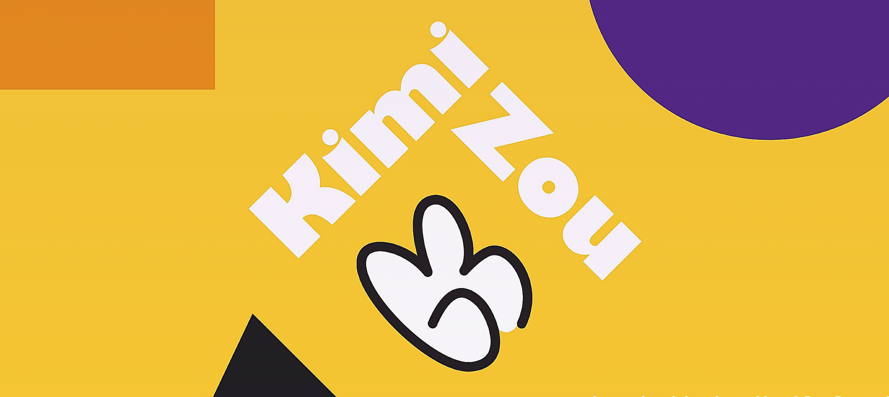

<link rel="stylesheet" href="https://cdn.jsdelivr.net/gh/devicons/devicon@v2.10.1/devicon.min.css">

 
 

## 😄&nbsp; Hello, I'm Kimi! 
I build full-stack web apps with appealing UI and smooth UX experience by working with great teams and writing easy-to-read and DRY code.

A little more about me...  
&nbsp; &nbsp; 🔭 &nbsp; I’m open to work and looking for junior software engineer positions  
&nbsp; &nbsp; 🌱 &nbsp; I’m currently reading <em>Eloquent JavaScript</em> 
&nbsp; &nbsp; 📫 &nbsp; How to reach me: 
<a href='https://www.linkedin.com/in/kimizou/'>LinkedIn</a>&nbsp; 
<a href='https://angel.co/u/kimi-zou'>AngelList</a>&nbsp;
<a href='mailto:kimizou.kz@gmail.com'>Email</a>&nbsp;
 
&nbsp; &nbsp; 😶 &nbsp; Pronouns: they/them  
&nbsp; &nbsp; ✨ &nbsp; Hobbies: Japanese Anime! Music! Basketball!

 

## 💻&nbsp; Technologies && Tools I Use:
- Languages:  
  
  
- Frontend:  
  
  
  
  
- Backend:  
  
  
  
  
- Others:  
  
  
  
  
  
  
  
- Design:  
  
  
  
  

 

## 🐾 &nbsp;  Web Apps I Built:
- <a href='https://capstone-make-a-wish.herokuapp.com/'>Make-a-Wish</a> - a birthday reminder app built for users to share birthday gift wishes to friends and family.
- <a href='https://anime-cloud.herokuapp.com/'>AnimeCloud</a> - a full-stack <a href='https://soundcloud.com/' style='text-decoration: none; color: inherit'><em>SoundCloud</em></a> clone made for Japanese Anime lovers.
- <a href='https://cheonjae.herokuapp.com/'>Cheonjae</a> - A <a href='https://genius.com/' style='text-decoration: none; color: inherit'><em>Genius</em></a> clone created for passionate K-pop fans.
- <a href='https://chorescore2020.herokuapp.com/'>ChoreScore</a> - A <a href='https://genius.com/' style='text-decoration: none; color: inherit'><em>Remember the Milk</em></a> clone made to assist users in completing their chores with a to-do like system.

 

## 🎏&nbsp; My Github Stats:

